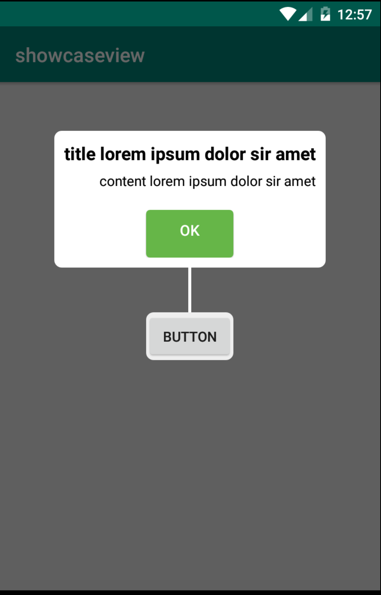

# ShowCaseView Android

This repo forked from [**ShowCaseView**](https://github.com/mreram/ShowCaseView)

## How to use?

1. **Create new variable**
    
   ``` 
   private GuideView mGuideView; 
   private GuideView.Builder builder; 
   ```
2. **Set builder in your activity**
   
   ```
   builder = new GuideView.Builder(this)
                .setTitle("title lorem ipsum dolor sir amet")
                .setContentText("content lorem ipsum dolor sir amet")
                .setViewAlign(AlignType.center)
                .setTitleGravity(Gravity.CENTER)
                .setContentGravity(Gravity.RIGHT)
                .setButtonGravity(Gravity.CENTER)
                .setButtonText("OK")
                .setTargetView(myButton)
                .setGuideListener(new GuideListener() {
                    @Override
                    public void onDismiss(View view) {
                       Log.d(TAG,"Success");
                    }
                });

        mGuideView = builder.build();
        mGuideView.show();
    ```



## Installation
	
**coming soon**


## Change type face

 	 new GuideView.Builder(this)
                .setTitle("Guide Title Text")
                .setContentText("Guide Description Text\n .....Guide Description Text\n .....Guide Description Text .....")
                .setTargetView(view)
                .setContentTypeFace(Typeface)//optional
                .setTitleTypeFace(Typeface)//optional
	            .setDismissType(DismissType.outSide) //optional - default dismissible by TargetView
                .build()
                .show();
  
## Change title and Content text size

   	new GuideView.Builder(this)
                .setTitle("Guide Title Text")
                .setContentText("Guide Description Text\n .....Guide Description Text\n .....Guide Description Text .....")
                .setTargetView(view)
                .setContentTextSize(12)//optional
                .setTitleTextSize(14)//optional
		    .setDismissType(DismissType.outSide) //optional - default dismissible by TargetView
                .build()
                .show();
		
## Change View

	new GuideView.Builder(this)
             .setTitle("Guide Title Text")
             .setContentText("Guide Description Text\n .....Guide Description Text\n .....Guide Description Text .....")
             .setViewAlign(AlignType.center)
             .setTargetView(view) 
	         .setDismissType(DismissType.outSide) //optional - default dismissible by TargetView
             .build()
             .show();
	     
	     
## use Spannable for Content
	
	 new GuideView.Builder(this)
                .setTitle("Guide Title Text")
                .setTargetView(view)
                .setContentSpan((Spannable) Html.fromHtml("<font color='red'>testing spannable</p>"))
	            .setDismissType(DismissType.outSide) //optional - default dismissible by TargetView
                .build()
                .show();
                	     
## Set Listener 
	
      new GuideView.Builder(MainActivity.this)
                      .setTitle("Guide Title Text")
                      .setContentText("Guide Description Text\n .....Guide Description Text\n .....Guide Description Text .....")
                      .setViewAlign(AlignType.center)
                      .setTargetView(view1)
		          .setDismissType(DismissType.outSide) //optional - default dismissible by TargetView
                      .setGuideListener(new GuideListener() {
                          @Override
                          public void onDismiss(View view) {
                             //TODO ...
                          }
                       })
                       .build()
                       .show();


### DismissType Attribute

| Type | Description |
| ------ | ------ |
| outside | Dismissing with click on outside of MessageView |
| anywhere | Dismissing with click on anywhere |
| targetView | Dismissing with click on targetView(targetView is assigned with setTargetView method) |

### New features

Since HappyFresh forked and using this repo from [**ShowCaseView**](https://github.com/mreram/ShowCaseView), i'm added some changes and new feature

| New | Description |
| ------ | ------ |
| setViewAlign(AlignType.center) | Gravity for view 
| setTitleGravity(Gravity.CENTER) | Gravity for title 
| setContentGravity(Gravity.CENTER) | Gravity for content description 
| setButtonGravity(Gravity.CENTER) | Gravity for Button
| setButtonText(string) | set button text